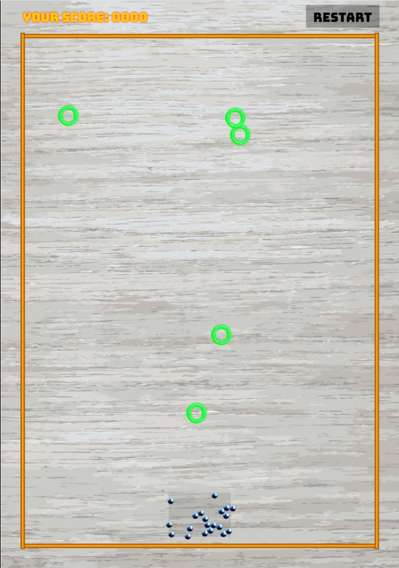

<h1 align="center">
  <br>
  <a href="https://github.com/evg4b/phaser3-demo#readme"></a>
  <br>
  Phaser 3 demo application
</h1>
<h4 align="center">
A simple game example based on <a href="https://github.com/yandeu/phaser-project-template">phaser-project-template.</a>
</h4>

## Preview and Demo

<div align="center">
  <a href="https://s3.eu-central-1.amazonaws.com/phaser3-typescript/starter-template/index.html">
    
  </a>
</div>

**Online demo**: [keen-franklin-de71dd.netlify.app](https://keen-franklin-de71dd.netlify.app/)

## How To Use

To clone and run this template, you'll need [Git](https://git-scm.com) and [Node.js](https://nodejs.org/en/download/) (which comes with [yarn](https://yarnpkg.com/)) installed on your computer. From your command line:

```bash
# Clone this repository
$ git clone --depth 1 git@github.com:evg4b/phaser3-demo.git

# Go into the repository
$ cd phaser3-demo

# Install dependencies
$ yarn

# Start the local development server (on port 8080)
$ yarn start

# Ready for production?
# Build the production ready code to the /dist folder
$ yarn build

# Play your production ready game in the browser
$ yarn serve
```

## Useful Links

- [Phaser Website](https://phaser.io/)
- [Phaser 3 Forum](https://phaser.discourse.group/)
- [Phaser 3 API Docs](https://photonstorm.github.io/phaser3-docs/)
- [Official Phaser 3 Examples](http://labs.phaser.io/)
- [Notes of Phaser 3](https://rexrainbow.github.io/phaser3-rex-notes/docs/site/index.html)
